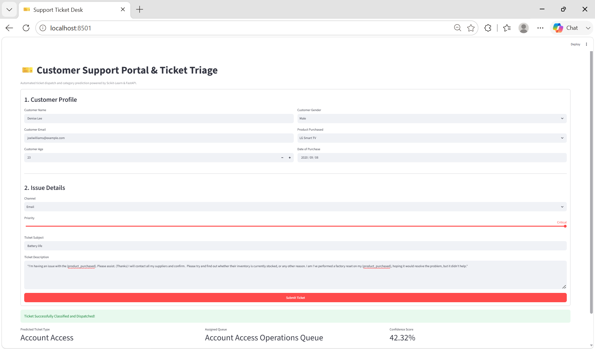

# 🏷️ Support-Ticket Category Classifier

[](https://fastapi.tiangolo.com/)
[](https://streamlit.io/)
[](https://scikit-learn.org/)
[](https://python.org/)

An end-to-end Machine Learning web application designed to sort incoming customer support tickets into the right category using NLP. The system ingests raw customer inquiries, extracts textual patterns, and automatically predicts the appropriate ticket category, confidence score, and operational routing queue in real time.

---

## 📸 Live Application Demo

<p align="center">
  
</p>

---

## ✨ Key Highlights

* 🔍 **Natural Language Processing (NLP)**: Standardizes and processes multi-field input (Ticket Subject + Ticket Description) using text normalization, cleaning regex, and TF-IDF n-gram vectorization.
* 🎯 **Automated Ticket Categorization**: Accurately sorts incoming support tickets into categories such as *Technical Issue*, *Billing Inquiry*, *Account Access*, *Hardware Issue*, and *Refund Request*.
* 📈 **Confidence Estimation**: Calculates real-time prediction probability using calibrated log-loss classifiers.
* ⚡ **Production-Ready Architecture**: Features an asynchronous backend powered by **FastAPI** coupled with an intuitive customer triage interface built in **Streamlit**.
* 🛡️ **Schema Validation**: Uses **Pydantic** models for strict request payload validation and error prevention.

---

## 🛠️ Tech Stack & Libraries

| Domain | Technology |
| :--- | :--- |
| **Frontend UI** | Streamlit |
| **Backend Framework** | FastAPI, Uvicorn |
| **Machine Learning & NLP** | Scikit-Learn (`TfidfVectorizer`, `SGDClassifier`), Pandas, NumPy |
| **Validation & Serialization** | Pydantic v2, Pickle |

---

## 📁 Repository Layout

```text
Support-Ticket-Category-Classifier/
├── backend/
│   ├── models/
│   │   └── ticket_classifier_pipeline.pkl  # Serialized NLP & classification pipeline
│   ├── __init__.py
│   ├── main.py                             # FastAPI prediction endpoints
│   ├── utils.py                            # NLP text-cleaning utilities
│   └── requirements.txt                    # Backend dependencies
├── frontend/
│   ├── app.py                              # Streamlit user interface
│   └── requirements.txt                    # Frontend dependencies
├── assets/
│   └── demo.png                            # Application output preview
├── customer_support_tickets.csv            # Support ticket dataset
├── train_local.py                          # Local NLP training & export script
└── README.md                               # Project documentation